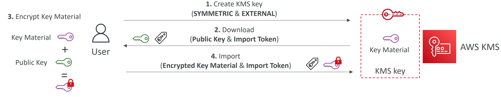

# AWS KMS keys

### Encryption in Flight
When ever we want to transmit sensitive information like say credit card information, we want to send the data **encrypted**, 
to prevent someone spoofing the information (called man-in-the-middle attacks)

This is enabled through use of SSL Certificates(HTTPS)

Nowadays almost all the information is sent over HTTPS

### Encryption at Rest

When the server is storing information like S3 or DynamoDB, the data also needs to be encrypted.
This is managed thanks to a key (Symmetric Encryption) and the server must have access to the key 

### How HTTPS works
Hypertext Transfer Protocol Secure (HTTPS) is an extension of the Hypertext Transfer Protocol (HTTP.)   
HTTPS transmits encrypted data using Transport Layer Security (TLS.) If the data is hijacked online, all the hijacker gets is binary code. 

#### How is the data encrypted and decrypted?


1. The client (browser) and the server establish a TCP connection.
2. The client sends a “client hello” to the server. The message contains a set of necessary encryption algorithms (cipher suites) and the latest TLS version it can support. The server responds with a “server hello” so the browser knows whether it can support the algorithms and TLS version.
3. The server then sends the SSL certificate to the client. The certificate contains the public key, host name, expiry dates, etc. The client validates the certificate. 
4. After validating the SSL certificate, the client generates a session key and encrypts it using the public key. The server receives the encrypted session key and decrypts it with the private key. 
5. Now that both the client and the server hold the same session key (symmetric encryption), the encrypted data is transmitted in a secure bi-directional channel.

#### Why does HTTPS switch to symmetric encryption during data transmission? There are two main reasons:
1. Security: The asymmetric encryption goes only one way. This means that if the server tries to send the encrypted data back to the client, anyone can decrypt the data using the public key.
2. Server resources: The asymmetric encryption adds quite a lot of mathematical overhead. It is not suitable for data transmissions in long sessions.


| What is a DDoS attack? |
|---|
|The purpose of a DDoS attack is to disrupt the normal traffic of the victim servers through malicious requests. As a result, the servers are swamped with malicious requests and have no buffer to handle normal requests.|
| **An example of a common DDoS attack is an SYN flood.**|
| Normally the client and server establish a TCP connection via a 3-way handshake. As a result of an SYN flood attack, zombies (network of computers controller by attacker) send many SYN requests to the server, but they never return the TCP ACK to the server. |
| This results in an exhaustion of resources on the victim server due to the accumulation of many half-open TCP connections.|


# AWS KMS 
Anytime you hear "encryption" for an AWS Sevice, it is most likely to be KMS.  
KMS is fully integrated with IAM for authorizer. You create users and roles who have permissions to do KMS operations. 

KMS is integrated into:
* EBS for encrypting volumes
* S3 for Server-side encryption of objects
* Redshift, RDS for encryption of data
* SSM Parameter Store and Secrets also
etc.

|KMS Features|
|---|
| KMS supports both **Symmetric** (AES-256 Keys) and **Asymmetric**(RSA & ECC public-private key pairs).   <br> You can not download the Symmetric and private Asymmetric keys, you need to use the KMS API calls to use the keys |
| **KMS is deeply integrated with IAM** like other AWS services. In order to use a KMS key, the user or role should have the required permissions, and the KMS Policy should also allow it |
| AWS also provides **Encryption SDK**, which provides features like Envelope Encryption and **Data Key Caching** (cache data keys reducing calls to KMS with a security trade-off) |
| KMS allows you to setup **Automatic Key Rotation** (every 1 year), which maintains the key ID, while changing the Key Material  <br> When a Key is rotated, **the previous key is kept active (using versions) so that we can still decrypt old data** |
| However when we **manually rotate a key**, a new Key is generated, and hence the KeyID will change and we **should use KeyAlias** instead of KeyID in such scenarios |
| We cannot delete CMKeys immediately, but rather there is a mandatory 7 to 30 days waiting period. <br> **During the waiting period, the KMS Key cannot be used for Encryption/Decryption** <br> Ideally, in such scenarios, we should setup CloudTrail (API call DENIED) -> SNS/EventBridge mechanisms to detect/cancel key rotation |

### KMS Multi-Region Key
You can use the same KMS keys in **multiple Regions**  with one Primary and Read Replicas (but still allowing encryption/decryption in all Regions using local keys).

This is especially useful in Disaster Recovery, DynamoDB/Aurora Global Tables, Active-Active applications spanning multiple regions  
When using **Multi-Region Keys**, the Key ARN and the key material is same across regions.
Hence, allowing to encrypt in one region and decrypt in another region without making cross region API calls

However, **You cannot change this setting after the key is created.**


### KMS Key Metadata
A KMS key contains metadata, such as the key ID, key spec, key usage, creation date, description, and key state.   
Most importantly, it contains a reference to the **key material** that is used when you perform cryptographic operations with the KMS key.

### Types of KMS Keys

#### AWS Owned Keys
These keys are Owned by AWS, and used internally by some AWS services, and DO NOT belong to your account.  
You **cannot** view, use, or audit these keys  


#### AWS Managed Keys
These keys are again Owned by AWS, but used for AWS services eg. **aws/s3, aws/ebv, aws/redshift** etc.  
While users **cannot** add resource policy to these keys, we can **VIEW the Key Policy** and see audit in CloudTrail

#### Customer Managed Keys
These keys are created, managed (enable, disable or delete) by us, we can also optionally rotate the keys every year  
More importantly, we can add a resource policy to these keys and audit these in CloudTrail.   
We can also use these keys in Envelope Encryption  
We can also give cross-account access to these keys using Key Policy

Comparison

| Type of KMS key | Can view KMS key metadata | Can manage KMS key | Used only for my AWS account | Automatic rotation | Pricing |
|---|---|---|---|---|---|
| Customer managed key| Yes| Yes| Yes| Optional. Every year (approximately 365 days) | Monthly fee (pro-rated hourly)<br><br> Per-use fee|
| AWS managed key |Yes| No| Yes| Required. Every year (approximately 365 days) | No monthly fee <br><br> Per-use fee (some AWS services pay this fee for you) |
| AWS owned key | No | No| No | Varies | No fees |


##### Bring Your Own Key- BYOK
While you cannot download the Symmetric Keys, you can import your own Key Material into a Customer Managed KMS Key (instead of AWS Generating one)    
You are responsible or key material's security, availability and durability outside of AWS as well as rotation of Key



### CMK Key Creation
When Creating a CMK, we need to choose the Key Material Origin which Can’t be changed after creation   
Key material is the string of bits used in a cryptographic algorithm. Secret key material must be kept secret to protect the cryptographic operations that use it. Public key material is designed to be shared.

Key Material Origin of **Symmetric Keys** can be  

| | |
|---|---|
| AWS_KMS |AWS KMS creates and manages the key material for the KMS key in its own key store. This is the default and the recommended value for most KMS keys.|
| EXTERNAL (Import key material) | When you create a KMS key with an External key material origin, the KMS key has no key material. Later, you can import key material into the KMS key. When you use imported key material, you need to secure and manage that key material outside of AWS KMS, including replacing the key material if it expires.
| AWS_CLOUDHSM | AWS KMS creates the key material in the AWS CloudHSM cluster for your AWS CloudHSM key store. |
| EXTERNAL_KEY_STORE | The key material is a cryptographic key in an external key manager outside of AWS. This origin is supported only for KMS keys in an external key store.|


### Key Rotation
Cryptographic best practices discourage extensive reuse of encryption keys. 

To create **new cryptographic material** for your AWS Key Management Service (AWS KMS) customer master keys (CMKs), you can create new CMKs, and then change your applications or aliases to use the new CMKs. 
Or, you can **enable automatic key rotation** for an existing customer-managed CMK.

* When you enable automatic key rotation for a customer-managed CMK, AWS KMS generates new cryptographic material for the CMK **every year**. 
* **AWS KMS also saves the CMK’s older cryptographic material in perpetuity so it can be used to decrypt data that it encrypted.**
* AWS KMS does not delete any rotated key material **until you delete the CMK**. 
* Key rotation changes only the CMK’s backing key, which is the cryptographic material that is used in encryption operations. The CMK is the same logical resource, regardless of whether or how many times its backing key changes.


##### Backing key management 
AWS KMS retains all backing keys for a CMK, even if key rotation is disabled.   
**The backing keys are deleted only when the CMK is deleted**.   
When you use a CMK to encrypt, AWS KMS uses the current backing key. When you use the CMK to decrypt, AWS KMS uses the backing key that was used to encrypt.

##### Enable and disable key rotation
Automatic key rotation is disabled by default on customer-managed CMKs.   
When you enable (or re-enable) key rotation, AWS KMS automatically rotates the CMK 365 days after the enable date and every 365 days thereafter.  

###### Disabled CMKs  
While a CMK is disabled, AWS KMS does not rotate it. However, the key rotation status does not change, and you cannot change it while the CMK is disabled.  
When the CMK is re-enabled, if the backing key is more than 365 days old, AWS KMS rotates it immediately and every 365 days thereafter. If the backing key is less than 365 days old, AWS KMS resumes the original key rotation schedule.

###### CMKs pending deletion.  
While a CMK is pending deletion, AWS KMS does not rotate it. The key rotation status is set to false and you cannot change it while deletion is pending.  
If deletion is canceled, the previous key rotation status is restored. If the backing key is more than 365 days old, AWS KMS rotates it immediately and every 365 days thereafter. If the backing key is less than 365 days old, AWS KMS resumes the original key rotation schedule.

###### AWS managed CMKs  
You cannot manage key rotation for AWS managed CMKs. AWS KMS automatically rotates AWS managed CMKs every year (365 days).
###### AWS owned CMKs
You cannot manage key rotation for AWS owned CMKs. The key rotation strategy for an AWS owned CMK is determined by the AWS service that creates and manages the CMK.

###### Monitoring key rotation
When AWS KMS automatically rotates the key material for an AWS managed CMK or customer-managed CMK, it writes the KMS CMK Rotation event to Amazon CloudWatch Events. You can use this event to verify that the CMK was rotated.

Automatic key rotation is not supported on the following types of CMKs, but you can rotate these CMKs manually.
1. Asymmetric CMKs 
2. CMKs in custom key stores 
3. CMKs that have imported key material


### Envelope Encryption

**KMS only encrypts data < 4KB** using Encrypt API (after validating required IAM permissions), and Decrypt API is used for decrypting  
If we want to encrypt > 4KB, we need to use **Client Side Envelope Encryption**  
  * In this case we use a **GenerateDataKey** API, which returns back a **Plaintext Data Encryption Key (PDEK)** as well as a **Encrypted Data Encryption Key (EDEK)**.   
  We use PDEK to encrypt the data file and before sending the file to server, create an envelope contains the EDEK + Encrypted File 
  * When we need to decrypt the file, a **Decrypt** API request is sent to KMS using EDEK (< 4KB), KMS returns response with PDEK and the Encrypted Data is decrypted using PDEK.

This is quite complicated, but AWS Encryption SDK implements Envelope Encryption for us as a CLI tool as well as implementions for Java, Python, C, Javascripts etc


### KMS Key Policies
KMS Key Policies are very essential to allow services and other users access to the KMS  
The Default KMS Key Policy gives access to the Key to only the root user, other users and services do not get access to the key

Consider the Default KMS Key Policy

```text
{
  "Effect": "Allow",
  "Action": "kms:*",
  "Principal": {
    "AWS": "arn:aws:iam::111122223333:root"
   },
  "Resource": "*"
}
```

* It gives the AWS account that owns the KMS key full access to the KMS key.
* It also gives the account administrators, including the account root user full access to the KMS key. 
* **Any other principals in the account will not have AUTOMATIC access to the key**
* **However, other principals in the account can add IAM policies to allow access to this key**  
* This is unlike S3 buckets, which are available to other users in the account unless explicitly denied.


Key Policy Comparison  

|| AWS Owned Keys | AWS Managed Keys | Customer Managed Keys |
|---|---|---|---|
View | NO | YES | YES |
Edit | NO | NO  | YES | 

eg. We **CAN VIEW** the KeyPolicy for AWS Managed Keys aws/ebs (but can't change it)
```text
{
    "Version": "2012-10-17",
    "Id": "auto-ebs-2",
    "Statement": [
        {
            "Sid": "Allow access through EBS for all principals in the account that are authorized to use EBS",
            "Effect": "Allow",
            "Principal": {
                "AWS": "*"
            },
            "Action": [
                "kms:Encrypt",
                "kms:Decrypt",
                "kms:ReEncrypt*",
                "kms:GenerateDataKey*",
                "kms:CreateGrant",
                "kms:DescribeKey"
            ],
            "Resource": "*",
            "Condition": {
                "StringEquals": {
                    "kms:CallerAccount": "865197160877",
                    "kms:ViaService": "ec2.eu-west-1.amazonaws.com"
                }
            }
        },
        {
            "Sid": "Allow direct access to key metadata to the account",
            "Effect": "Allow",
            "Principal": {
                "AWS": "arn:aws:iam::865197160877:root"
            },
            "Action": [
                "kms:Describe*",
                "kms:Get*",
                "kms:List*",
                "kms:RevokeGrant"
            ],
            "Resource": "*"
        }
    ]
}
```

### KMS Grants
KMS Grants allow you to grant **temporary permissions** to other AWS Accounts, IAM Users or Roles within your account.  
This differs from Key Policy because it is used for temporary permission.  
These grants **do not expire automatically**, but need to be deleted manually 

KMS Grants only work via API/CLI not with AWS Console

**KMS Grants are used by AWS Services all the time**, to create a Grant on behalf of a user in the account, use the permission and then retire the grant as soon as the task is complete.   
For example, when we launch an EC2 instance, **AWS EBS API, behind the scenes, creates a Grant on the Encrypted Root EBS Volume KMS key**, and is able to decrypt the volume

KMS Keys which are used for such scenarios have a **kms:CreateGrant** and Condition **kms:GrantIsForAWSResource:true** in their Key Policy
```text
{
  "Sid": "Allow attachment of persistent resources",
  "Effect": "Allow",
  "Principal": {"AWS": "arn:aws:iam::111122223333:role/EncryptionApp"},
  "Action": [
    "kms:ListGrants",
    "kms:CreateGrant",
    "kms:RevokeGrant"
  ],
  "Resource": "*",
  "Condition": {"Bool": {"kms:GrantIsForAWSResource": true}}
}
```

#### KMS Condition Keys
Some interesting and often seen KMS Condition Keys
* **kms:ViaService** eg ec2.eu-west-1.amazonaws.com, rds.us-west1.amazonaws.com
* **kms:CallerAccount** to allow/deny access to all identities in an AWS Account
* We can also use ABAC on Keys using conditions like aws:ResourceTag/Environment eg PROD


### KMS with EBS
1. You can not change (and enable) the encryption key used by an existing EBS volume
2. However, you can create an EBS snapshot, and create a new EBS volume with a new KMS Key
3. Since KMS Keys belong to an account, if we want to copy an EBS snapshot to another account, the copy will have a different KMS key. We need to setup grants on the source KMS key first
4. Similarly, if we want to Share an EBS snapshot to another account, we can use a shared KMS key (not the default aws/ebs KMS key) to create the EBS snapshot 
5. EBS Encryption is a Account level setting which can be turned on per-region basis (remember there is a cost associated with use of KMS)


### KMS with SSM Parameter Store
1. SSM Parameter Store uses KMS to encrypt/decrypt parameter values of type **Secure String**
2. **Standard Secure Parameter** Keys have value size up to 4 KB and can use default aws/ssm key or another key
3. **Advanced Secure Parameter** Keys have value size up to 8 KB and use Envelope Encryption


### KMS with Secrets Manager
1. Secrets Manager is used exclusively for storing Secrets with capability to force rotation of secrets every X days (using a Lambda function)
2. It is integrated with Amazon RDS (MySQL, PostgreSQL, Aurora) and can be used to **automatically update the DB user credentials on rotation** 
3. It can **Replicate Secrets across multiple AWS Regions**, while keeping read replicas in sync with the primary Secret
4. **Each Secret value is encrypted with a unique data key (Envelope Encryption)**
5. We can also use SSM GetParameter API to retrieve a Secret Manager secrets, using  **/aws/reference/secretsmanager/secret-id**

### KMS with S3

Each AWS S3 Object Encryption can be done using one of these 4 methods

| Server-Side Encryption with S3-Managed Keys (SSE-S3) (DEFAULT) | Server-Side Encryption with KMS Managed Keys (SSE-KMS) | Server-Side Encryption With Customer-Provided Keys (SSE-C) | Client-Side Encryption |
|---|---|---|---|
| SSE-S3 is the DEFAULT level of encryption setting of new objects that are uploaded to an S3 bucket.  <br> <br>SSE-S3 encrypts S3 objects using keys handled & managed by AWS internally| using AWS KMS (generated or the default aw/s3) to manage encryption keys, hence **more secure** as a user needs permission to both object + key <br><br>**S3 Data Key**<br>To reduce calls to KMS, AWS generates a short-lived bucket-level key from AWS KMS then temporarily keeps it in S3, and uses this to create data keys for new objects during its lifecycle | You upload the file **as well as your own encryption keys, S3 encrypts the data using keys, but does not store the keys** | client encrypts the data before uploading to S3 using client libraries such as Amazon S3 Client-Side Encryption Library|
| Requests must be sent with header **"x-amz-server-side-encryption": "AES256"** | Requests must be sent with header **"x-amz-server-side-encryption": "aws:kms"** | HTTPS is mandatory for SSE-C
| | If you upload and download a lot of files, you may be impacted by the KMS Rate limits | |

In **Glacier** storage class, all data is AES-256 encrypted, **and the key is under AWS control**

Using Bucket Policies, we can "enforce encryption" and refuse any API Calls to put an S3 object without Encryption Headers (eg. SSE-KMS or SSE-C).
eg.
```text
"Version": "2012-10-17",
"Statement": [
{
    "Effect": "Deny",
    "Action": "s3: PutObject",
    "Principal": "",
    "Resource": "arn:aws:s3:::my-bucket/*",
    "Condition": {
        "StringNotEquals": {
            "s3:x-amz-server-side-encryption": "aws: kms"
        }
    }
}

```


On a side-note, here is an interesting example policy that denies any Amazon S3 operation if the request is not authenticated by using MFA. 

```text
{
    "Version": "2012-10-17",
    "Id": "123",
    "Statement": [
      {
        "Sid": "",
        "Effect": "Deny",
        "Principal": "*",
        "Action": "s3:*",
        "Resource": "arn:aws:s3:::DOC-EXAMPLE-BUCKET/taxdocuments/*",
        "Condition": { "Null": { "aws:MultiFactorAuthAge": true }}
      }
    ]
 }
```
The Null condition in the Condition block evaluates to true if the aws:MultiFactorAuthAge condition key value is null, indicating that the temporary security credentials in the request were created without an MFA device.


##### Large File Upload to S3 with KMS Key
* When uploading a large file to S3 with KMS encryption, you’ll have to use S3 multi-part upload
* You must have the following permissions to the KMS Key:
  * **kms:GenerateDataKey** – allows you to encrypt each object part with a unique Data Key 
  * **kms:Decrypt** – decrypt object parts before they can be assembled, then re-encrypt them with the KMS Key


### KMS with RedShift
Encryption is an optional, immutable setting of a cluster. **If you want encryption, you enable it ONLY during the cluster launch process.**

Amazon Redshift uses a four-tier, key-based architecture for encryption. The architecture consists of data encryption keys, a database key, a cluster key, and a master key.  
Data encryption keys encrypt data blocks in the cluster. Each data block is assigned a randomly-generated AES-256 key. These keys are encrypted by using the database key for the cluster.  
The database key encrypts data encryption keys in the cluster. The database key is a randomly-generated AES-256 key. It is stored on disk in a separate network from the Amazon Redshift cluster and passed to the cluster across a secure channel.  
The cluster key encrypts the database key for the Amazon Redshift cluster.  


### KMS with DynamoDB

Encryption at rest also protects DynamoDB streams, global tables, and backups whenever these objects are saved to durable media.   
**All DynamoDB tables are encrypted. There is no option to enable or disable encryption for new or existing tables.**   
By default, all tables are encrypted under an AWS owned key in the DynamoDB service account. However, you can select an option to encrypt some or all of your tables under a customer managed key or the AWS managed key for DynamoDB in your account.


### KMS with EFS
Amazon EFS supports two forms of encryption for file systems, encryption of data in transit and encryption at rest.  
You can **enable encryption of data at rest ONLY when creating an Amazon EFS file system**.   
You can enable encryption of data in transit when you mount the file system.


# CloudHSM

While with KMS, AWS provides the software and keys for encryption, with CloudHSM, only provisions the dedicated encryption Hardware.  
This Dedicated Hardware (HSM = Hardware Security Module) is tamper resistant, FIPS 140-2 Level 3 compliance
* Supports both symmetric and asymmetric encryption (SSL/TLS keys)
* Manages the Users, Permissions as well as the Keys (much like a database)
* We need to provision a CloudHSM in each Availability Zone for HA clusters
* **AWS KMS can talk to this CloudHSM for seamless integration with services like EBS, S3, RDS etc**


# Cloudfront Key Pairs
CloudFront can use access keys to authenticate requests you make to CloudFront. Trusted signers with at least one CloudFront key pair can create signed URLs that can be used to temporarily access private content that's stored in your origin server (S3 bucket).


Each CloudFront key pair includes a public key, private key, and an ID for the key pair. You can only have up to two key pairs per AWS account.

Here is an example of a signed url:

```text
http://mybucket.amazonaws.com/image.png?AWSAccessKeyId=YW6OAKIAAKIAJQCRVTSRQ&Expires=1274228859&Signature=OlnE7O5PSMz4pzaE7O5PRKD/ws%3D
```

Notice that the signed url contains the public CloudFront Access Key ID and an expiration date (default = 24 hrs).

When you create signed URLs or signed cookies, you use the private key from the trusted signer’s key pair to sign a portion of the URL or the cookie.  
When someone requests a restricted object CloudFront compares the signed portion of the URL or cookie with the unsigned portion to verify that the URL or cookie hasn’t been tampered with.   
CloudFront also verifies that the URL or cookie is valid, meaning, for example, that the expiration date and time hasn’t passed.

